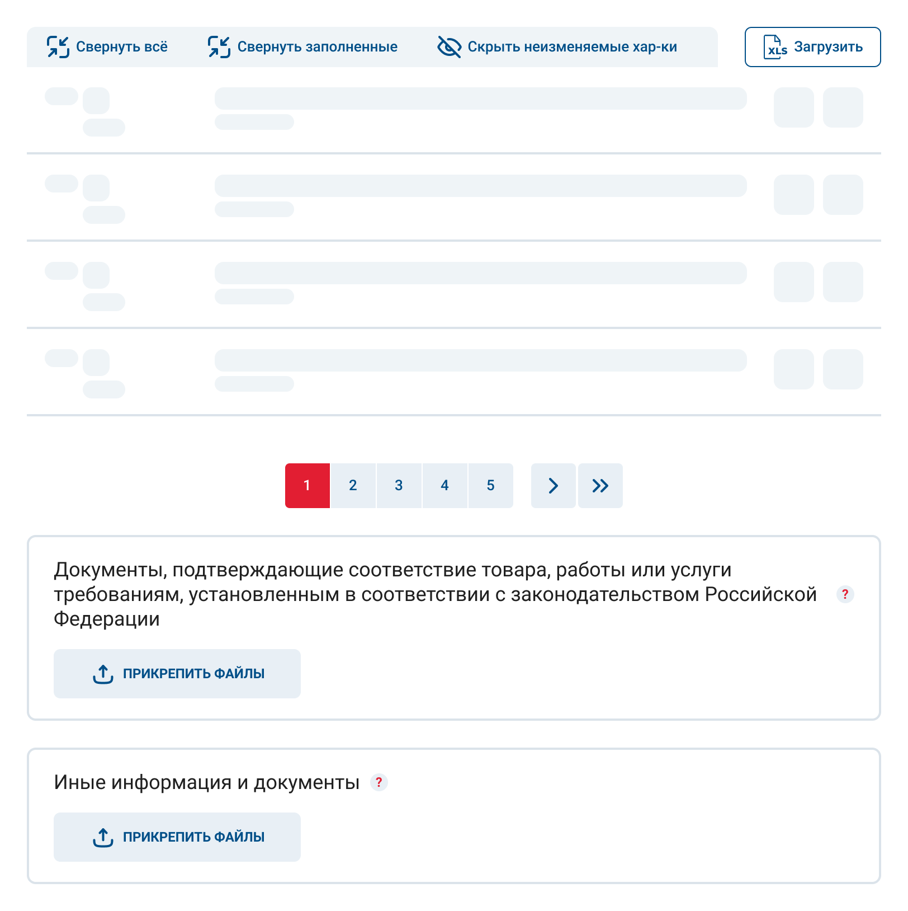
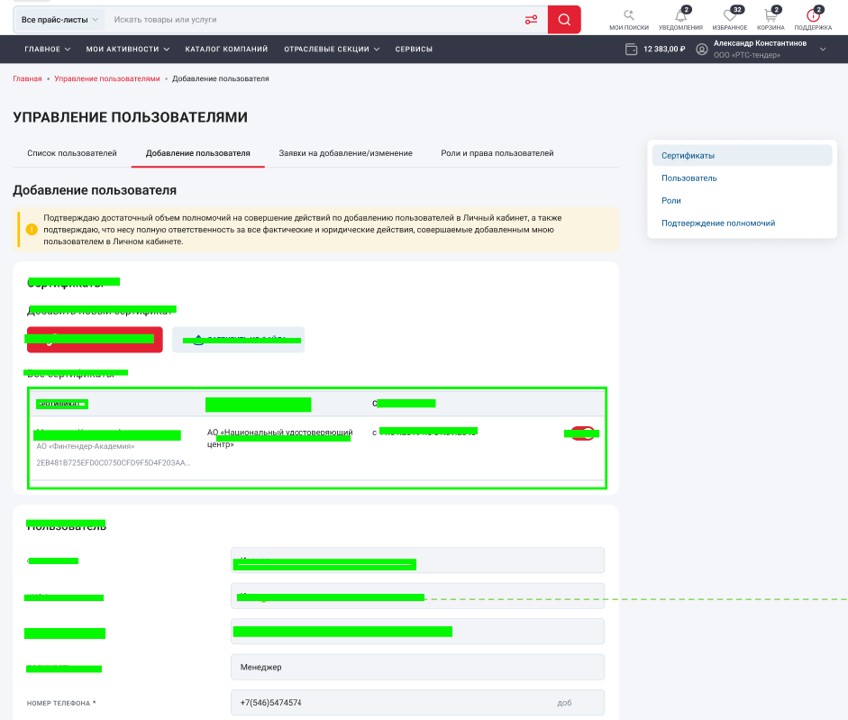

# Загрузка и скелетоны <Badge type="warning" text="Не подтверждено командой" /> <Badge type="tip" text="Подтверждено дизайнером" />

Выбор типа индикатора загрузки зависит от предсказуемости структуры данных

## Skeleton (предпочтительно)

Используется, если заранее известна структура будущего контента

### Как делать

- Скелетон должен приблизительно повторять структуру страницы (основные блоки, композиция)
- Достаточно отразить ключевые элементы, без полной детализации
- Не требуется скелетонить весь экран — 2–3 характерных блока достаточно
- Цель — помочь пользователю быстрее сформировать представление о будущем контенте

### Как это выглядит



### Пример реализации

Зеленым выделены будущие скелетоны

❌ Не игнорируй фон из макета (например, белую подложку)



✅ Используй класс `rts-skeleton` из UI Kit

```html
<app-page-section>
  <div class="rts-skeleton title"></div>

  <div class="row">
    <div class="rts-skeleton"></div>
    <div class="rts-skeleton"></div>
    <div class="rts-skeleton"></div>
  </div>

  <div class="row">
    <div class="rts-skeleton"></div>
    <div class="rts-skeleton"></div>
    <div class="rts-skeleton"></div>
  </div>
</app-page-section>
```

## Preloader

Используется, если структура данных заранее неизвестна или может значительно отличаться

::: warning TODO

Добавить примеры кода

:::
