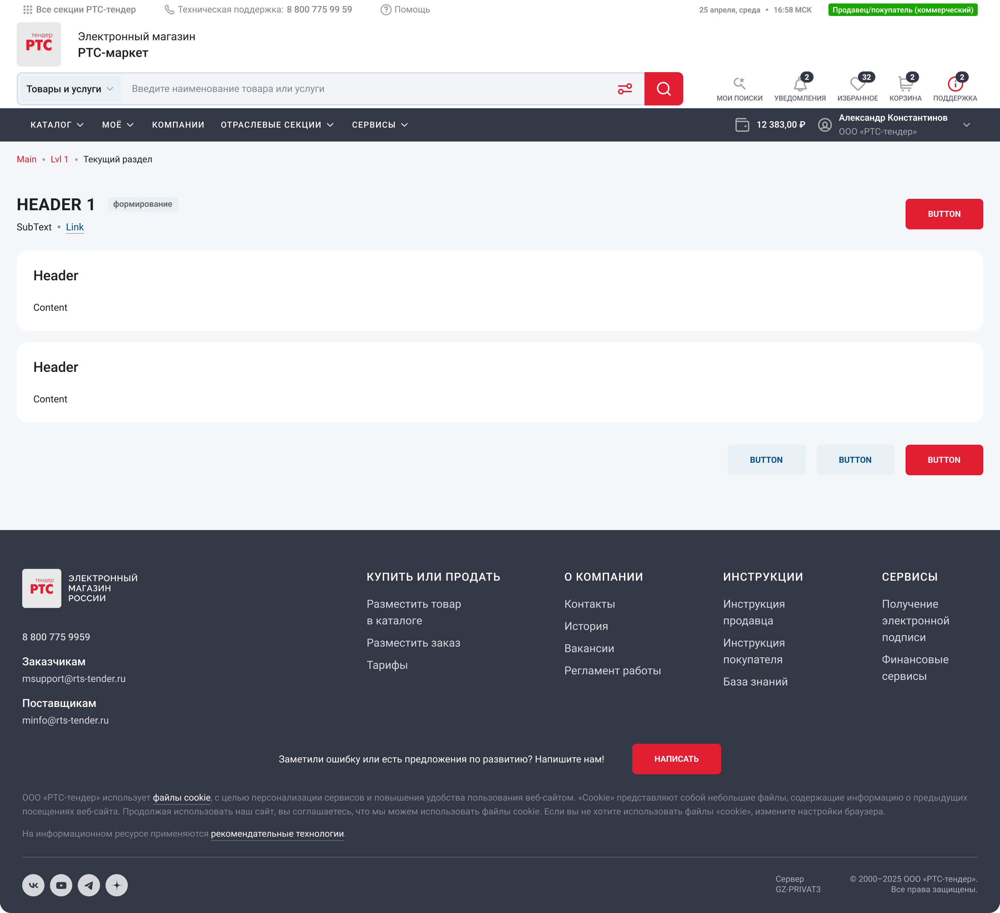

# Сборка страницы <Badge type="warning" text="Не подтверждено командой" />

## Принцип

✅ Собирай страницу из готовых compound (`ng-content` вместо `input`) компонентов

❌ Не пиши свои классы и обёртки

## Структура

Страница собирается из layout-компонентов:

- `app-page-layout` — корневой контейнер
- `app-page-title` — заголовок страницы
- `app-page-content` — контентная область

Колонки:

- `pageContentMain` — основная колонка
- `pageContentRight` — правая колонка (опционально)
- `pageContentLeft` — левая колонка (опционально)

Секции (блоки):

- `app-page-section` — секция
- `app-page-section-title` — заголовок секции
- `app-page-section-group` — группа внутри секции
- `app-page-section-group-label` — лейбл группы
- `app-page-section-row` — строка внутри группы
- `app-page-section-row-label` — лейбл строки

## Пример



```html
<app-page-layout>
  <app-page-title headerTitle="Header 1" />

  <app-page-content>
    <div pageContentMain="sections">
      <app-page-section>
        <app-page-section-title>Header</app-page-section-title>

        <app-page-section-group>
          <div>Content</div>
        </app-page-section-group>
      </app-page-section>

      <app-page-section>
        <app-page-section-title>Header</app-page-section-title>

        <app-page-section-group>
          <div>Content</div>
        </app-page-section-group>
      </app-page-section>

      <div buttonGroup>
        <button rtsSecondaryButton>BUTTON</button>
        <button rtsSecondaryButton>BUTTON</button>
        <button rtsPrimaryButton>BUTTON</button>
      </div>
    </div>
  </app-page-content>
</app-page-layout>
```
